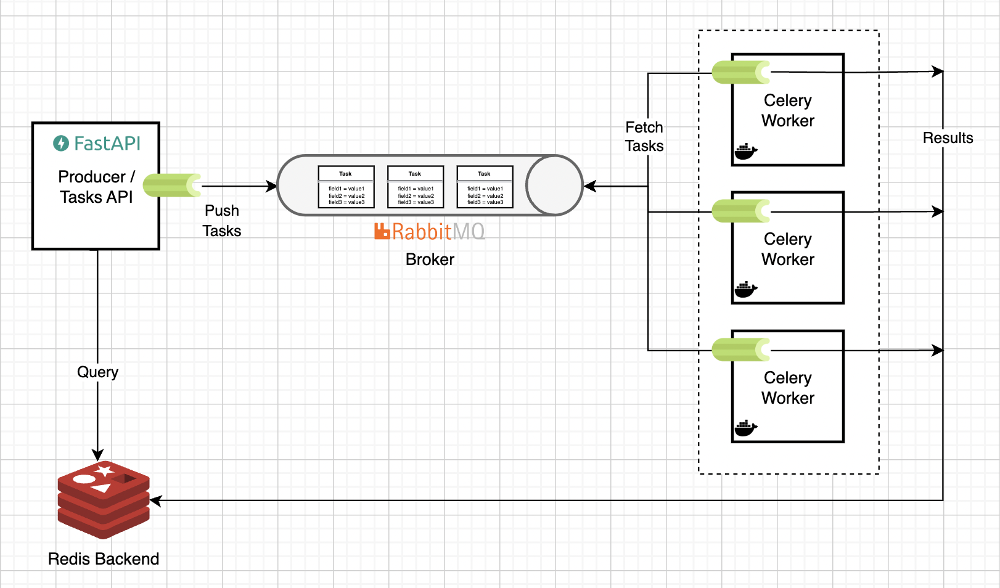

# Distributed Task Queue

This is an implementation of a distributed task queue in Python 
using [Celery](https://docs.celeryq.dev/en/stable/index.html). An extensive write-up 
for this project is 
available [here](https://particle1331.github.io/ok-transformer/nb/mlops/04-tasks.html).

> In particular, we will consider the scenario where we have (1) instances running long-running tasks on two processes such that (2) the instance can terminate any time (e.g. with autoscaling). Any time-consuming or resource-intensive computation that can be offloaded from the main application as background task such as ML model training and inference can be orchestrated using this approach.

A scalable architecture is shown in the figure below:




## Installation

Clone this repository and run the following in the project root directory:

```
docker compose up
```

**Note:** Run `docker ps` to see the URL of each service.
